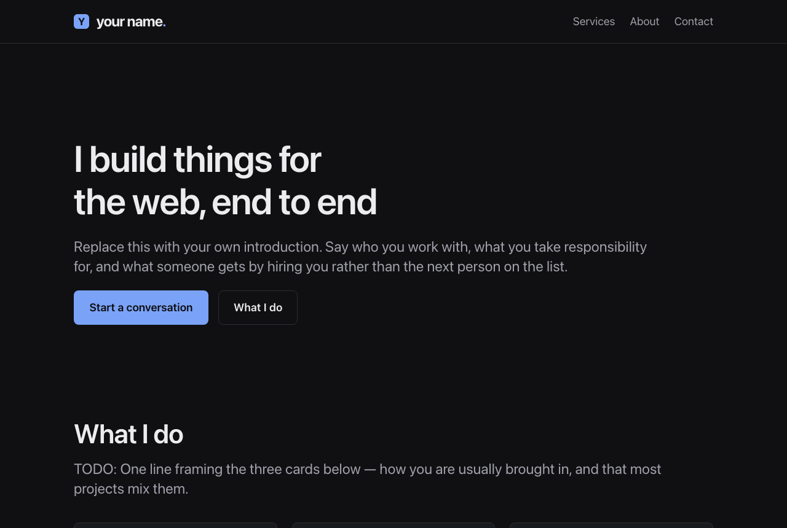

# zero-js-astro-starter

A one-page personal site built in Astro that ships **zero client-side
JavaScript**. Dark by design, system fonts, WCAG AA throughout, and a single flag
that keeps it out of Google until you are ready.



**[Live demo →](https://template.iamlukia.com)** · [full-page screenshot](docs/screenshot-full.png)

## Why this exists

Most portfolio templates ship a framework, a webfont, an animation library and a
cookie banner to render two screens of text. This one renders the same page with
nothing in the `<script>` budget at all, because the constraints are the point:

- **0 KB of JavaScript.** No hydration, no islands, no client runtime. The
  contact form is a native HTML `POST`; the nav wraps to a second row instead of
  using a hamburger. Run `npm run build` and grep `dist/` — there is no `.js` in it.
- **No webfont request.** The system font stack looks native on every platform
  and costs nothing to load, so there is no flash of unstyled text and no layout
  shift.
- **Dark only, deliberately.** The site declares `color-scheme: dark` rather than
  following `prefers-color-scheme`, so form controls, scrollbars and mobile
  browser chrome all follow the page instead of framing it in light-mode UI.
- **WCAG AA throughout.** Every text pairing clears 6.9:1 where AA asks for
  4.5:1, measured on the card background as well as the page. Interactive
  borders meet the separate 3:1 minimum AA sets for non-text contrast.
  `prefers-reduced-motion` and `:focus-visible` are handled globally.
- **Fluid type and spacing via `clamp()`.** One type scale and one spacing scale,
  both interpolating with the viewport, so the layout needs no breakpoints. The
  one width media query the template ships is not a layout one — it sits in
  `Nav.astro` and offsets in-page anchors against the sticky header, whose height
  steps at every point the header wraps.
- **A launch switch that actually works.** One flag hides the whole site from
  search engines — see [Going live](#going-live), which explains the part most
  people get wrong.

### Lighthouse

Run against the [live demo](https://template.iamlukia.com) on 2026-07-31,
mobile, Lighthouse 12.8.2:

| Performance | Accessibility | Best Practices | SEO |
| :---------: | :-----------: | :------------: | :-: |
|   **100**   |    **100**    |    **100**     | **100** |

The whole page is **3 requests and 7.2 KB** — the document, one stylesheet and
the favicon. Total Blocking Time is 0 ms and Cumulative Layout Shift is 0,
which is what you would expect from a page with no script to block on and no
webfont to swap in.

Reproduce it yourself:

```bash
npx lighthouse https://template.iamlukia.com \
  --only-categories=performance,accessibility,best-practices,seo \
  --chrome-flags="--headless"
```

## Quick start

Click **Use this template** at the top of this repo, then:

```bash
npm install
cp .env.example .env      # add a Web3Forms key when you want the form to work
npm run dev               # http://localhost:4321
```

Node ≥ 22.12 is required (Astro 7). The exact version is pinned in `.nvmrc`.

| Command           | Action                                     |
| :---------------- | :----------------------------------------- |
| `npm install`     | Install dependencies                       |
| `npm run dev`     | Dev server on http://localhost:4321        |
| `npm run build`   | Build the production site to `./dist/`     |
| `npm run preview` | Serve `./dist/` to check the built output  |

There is no test suite, linter or formatter — `npm run build` runs Astro's own
type-check and is the only verification step.

## Make it yours

**1. Copy.** Everything site-wide lives in `src/consts.ts` — title, description,
canonical origin, locale, contact address, nav items, social links. Start there,
then work through the page itself. Every editable placeholder is marked `TODO:`,
and two of them sit outside `src/` — the domain in `astro.config.mjs` and the
mark in `public/favicon.svg` — so sweep all three paths:

```sh
grep -rn "TODO:" src astro.config.mjs public
```

The one placeholder no marker can reach is `public/og.png`: it is binary, so
step 2 below is its only reminder.

If your name is much longer than the placeholder, or you add a nav item, check
the sticky header before you ship. It wraps as the viewport narrows and its
height steps at every wrap point; in-page anchors are offset against that by
`--header-offset` in `src/components/Nav.astro`. Narrow your browser and watch
**three** widths, not one: where the nav drops below the brand, where the nav's
own list wraps onto a second line, and how far up the phone-width tightening at
the bottom of that file needs to reach. The three labels shipped here only ever
do the first, which is why two values are enough for them — a longer wordmark or
a fourth label can add the second, and that is a third height needing a third
value and another media query. The third width is the one with no height of its
own: that tightening is capped just below the width where *these* labels stop
wrapping, so a wrap point above the cap is one it cannot move — however much it
may still help you at narrower widths. Too low a breakpoint is the harmful
direction, because the header then covers the heading you jumped to. The
comment on that rule has the measurements and the method, and it is marked
`TODO:` so the placeholder sweep finds it.

**2. The mark.** The nav brand derives its letter from `SITE_TITLE`, so it follows
your name automatically. The favicon set in `public/` is static and does not —
replace `public/favicon.svg` with your own, then regenerate the raster versions
(the instructions are in a comment at the top of that file). `public/og.png` is
the 1200×630 social card; regenerate that too, or the first person who shares
your site will post "Your Name".

**3. Your domain.** Set it in **two** places — `site` in `astro.config.mjs` and
`SITE_URL` in `src/consts.ts`. The first drives the sitemap; the second drives
canonical tags, `og:` URLs and the contact form's redirect. They are the same
origin held twice and must not drift.

Editing both literals is the normal path and nothing else is required. If you
later want one branch to deploy to several origins — a preview environment, a
staging host — `PUBLIC_SITE_URL` overrides both at build time; see § [Deploy](#deploy).

## Where things live

```
src/
├── consts.ts                  All site-wide copy and config — start here
├── styles/global.css          Design tokens, type scale, layout primitives
├── layouts/BaseLayout.astro   <head>, meta tags, canonical URL, page chrome
├── components/                Nav · Footer · Section · ContactForm
└── pages/                     index · thanks · 404 · robots.txt
```

`src/components/Section.astro` is the standard page section — it renders the
wrapper, an optional heading wired up with `aria-labelledby`, an optional intro
and then your content. Use it rather than hand-rolling `<section>` markup.

## Contact form

Posts to [Web3Forms](https://web3forms.com), which needs no backend of your own.
Set `PUBLIC_WEB3FORMS_KEY`:

- locally — copy `.env.example` to `.env` and fill it in
- in production — your host's environment variables

Until it is set, the form renders a visible "not wired up" notice and its Send
button stays disabled, rather than failing silently — so a form that is not
wired up cannot swallow a visitor's message.

The key is public by design; it appears in the page source of every Web3Forms
site. The env var gives it one home, not secrecy — don't put anything genuinely
sensitive behind a `PUBLIC_` prefix.

Spam protection is the `botcheck` honeypot plus Web3Forms' own server-side check,
both free. Note that **Turnstile requires a paid Web3Forms Pro plan**; free
hCaptcha is the fallback if spam becomes a real problem. There is a marked
`CAPTCHA SLOT` in `src/components/ContactForm.astro` for either.

**Worth knowing what the honeypot does not cover.** It is markup, so it only sees
a bot that loads the page and fills the form in. Since the key is public, the
cheaper abuse is to read it out of your page source and POST it straight to
`api.web3forms.com/submit` — a path that renders nothing, so the honeypot is not
in the way of it. What that costs is your **quota** rather than your patience:
250 submissions a month on the free plan, after which genuine messages stop
arriving.

**A captcha does cover it, and that is the trade this template is making.**
Enabling hCaptcha in the Web3Forms dashboard makes a valid captcha token
[mandatory on every submission](https://docs.web3forms.com/getting-started/customizations/spam-protection/hcaptcha)
— it is checked server-side, so a scripted POST with no token is rejected too.
It is free. **The catch is the page cost:** it needs
`<script src="https://web3forms.com/client/script.js" async defer></script>`,
which is a third-party script on every page and the one change that breaks this
template's premise. So the `CAPTCHA SLOT` is a real fix held back for a real
reason, not a fix that would not work — if a zero-JS budget is not sacred to your
project, turn it on.

Restricting the key to your own domain is the other option and it is weaker than
it sounds: it is a
[Pro feature](https://docs.web3forms.com/getting-started/pro-features/restrict-to-domain),
it stops the form working locally, and it can only check `Origin`/`Referer` —
headers a scripted client sets to whatever it likes. Web3Forms' own wording is
that it "will *potentially* reduce spam attacks".

## Deploy

Static output, no adapter, so any static host works. On **Cloudflare Pages**:

1. Workers & Pages → Create → Pages → Connect to Git, and pick your repo.
2. Build command `npm run build`, output directory `dist`.
3. Environment variables, set for **both Production and Preview**:
   - `PUBLIC_WEB3FORMS_KEY` — your Web3Forms access key.
   - `NODE_VERSION` — `22.17.1`.

Two more are optional and exist so one branch can serve more than one origin.
Both fall back to the committed values in `src/consts.ts`, so ignoring them
entirely is a supported way to use this template:

- `PUBLIC_SITE_URL` — overrides `site` and `SITE_URL` together, so canonical
  tags, `og:` URLs, the sitemap and `robots.txt` all move as one. Setting it on
  a **Preview** environment stops preview builds advertising the production
  origin. Note Cloudflare gives each deployment its own
  `<hash>.<project>.pages.dev` URL, so one value can only match the stable
  branch-alias URL rather than every individual preview.
- `PUBLIC_SITE_NOINDEX` — `false` makes the build indexable without editing
  `src/consts.ts`. Only the exact string `false` does that; anything else leaves
  the site hidden, so a typo fails in the safe direction.

Prefer the **host's** environment variables over a local `.env` for these two.
A plain `.env` does work — `astro.config.mjs` calls `process.loadEnvFile()` so
that both reads see it, and a host variable still wins over the file — but
mode-specific files (`.env.production`, `.env.local`) are read by `src/consts.ts`
and not by `astro.config.mjs`, which would split the origin between the two.

**`NODE_VERSION` is not optional.** Pages' default Node predates Astro 7's 22.12
floor and the build fails without it. `.nvmrc` is committed as a second line of
defence.

Confirm the `*.pages.dev` URL renders before attaching a custom domain. When you
do, make the apex canonical so it matches `site` in `astro.config.mjs`, and send
`www` to it with a 301 redirect rule.

`src/pages/404.astro` builds to `dist/404.html`, which Pages serves automatically
for unmatched paths on a static project — no `_routes.json` needed.

`public/_headers` ships a CSP and the usual hardening headers, read by Pages and
by Netlify. Its `script-src 'none'` is the zero-JS budget enforced rather than
asserted, so adding a script means widening it — the comments in the file say how.

## Going live

The site ships **hidden from search engines**. `SITE_NOINDEX` in `src/consts.ts`
is `true`, which makes every page emit `noindex, nofollow` and stops `robots.txt`
advertising the sitemap. Flip it to `false` when you are ready; that one change is
enough, because `robots.txt` and the per-page meta tag both read from it.

(`PUBLIC_SITE_NOINDEX=false` in the build environment does the same thing without
an edit, which is how this repo's own demo is deployed. Editing the file is the
simpler answer for a single site.)

The subtlety worth understanding before you "improve" it: while hidden,
`robots.txt` still **allows** crawling. Adding `Disallow: /` looks stricter but is
counterproductive — it stops crawlers fetching the page at all, so they never see
the `noindex`, and a URL can sit in the index on the strength of inbound links
alone, title-only with no content. Letting crawlers in *so they can read the
noindex* is what actually keeps you out of search results.

## Design decisions

Things that look like omissions but are choices:

- **No JavaScript.** Adding a `<script>` or a hydrated island is the one change
  that breaks the premise of this template. The nav wraps rather than collapsing
  into a hamburger; the form redirects server-side rather than `fetch`-ing.
- **Dark only.** A light theme is not a missing feature. Supporting both doubles
  the surface you have to keep accessible for a page this small.
- **A honeypot, not a captcha.** The `botcheck` field costs nothing, blocks the
  form-filling bots that target static contact forms, and asks nothing of your
  visitors. **The reason it is not a captcha is the no-JavaScript rule above, not
  effectiveness** — Web3Forms' free hCaptcha is enforced server-side and would
  also cover the direct-POST path the honeypot cannot see, but it needs a
  third-party `<script>` on every page. That is the trade; § Contact form spells
  it out. Escalate if real spam arrives and you would rather have the protection
  than the empty script budget.
- **`robots.txt` is a generated route**, not a file in `public/`, precisely so it
  cannot drift out of step with `SITE_NOINDEX`.
- **Plain CSS with custom properties.** No Tailwind, no preprocessor. Tokens in
  `global.css` mean changing a value in one place propagates everywhere, with
  nothing to compile or configure.
- **Body copy capped at 66 characters.** Line length is the highest-leverage
  readability control on a text-heavy page.

## How the live demo is built

There is one branch. `main` is the template — placeholder copy, `example.com` as
the origin, `SITE_NOINDEX = true` — and the [live demo](https://template.iamlukia.com)
is that same branch built with `PUBLIC_SITE_URL` and `PUBLIC_SITE_NOINDEX` set,
because the demo is marketing and needs a real origin and to be indexable.

Nothing about that is specific to this repo, and it is the reason those two
overrides exist at all: **one branch can deploy to more than one origin.** A
preview or staging deployment sets `PUBLIC_SITE_URL` to its own hostname and gets
correct canonical URLs, `og:` URLs and sitemap entries instead of advertising the
production origin — which is what a preview deploy does by default, and it is a
real SEO hazard rather than a cosmetic one.

You do not have to use either variable. Leave both unset and the committed
literals ship, which is the path § [Make it yours](#make-it-yours) describes.

## Licence

[MIT](LICENSE) — use it for anything, commercial work included. Attribution is
welcome but not required.
